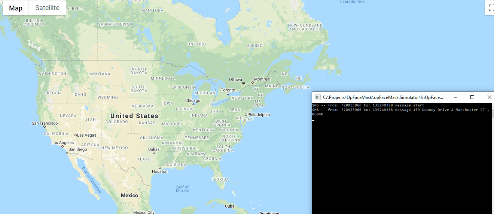
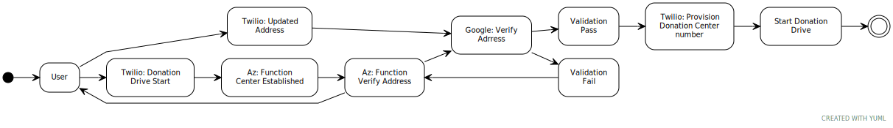

  
 
# SMS Powered Realtime COVID-19 Mask Donation Drive tracker 

## About

This application provides the ability for users to run grassroots donation drives for coordinating home-made and donated face masks as part of the effort to curb the spread of COVID-19 virus. Users can control their donation drives by sending text messages to a designated auto-provisioned Twilio number and start receiving and distributing face masks.

>This is a sample application developed for [Twilio x DEV community hackathon](https://dev.to/devteam/announcing-the-twilio-hackathon-on-dev-2lh8). 

## Twilio APIs Used
* Programmable SMS
  * Twilio.Rest.Api.V2010.Account
  * Twilio.Rest.Api.V2010.Account.AvailablePhoneNumberCountry

Implementations in other languages:

| .NET | Java | Python | PHP | Ruby |
| :--- | :--- | :----- | :-- | :--- |
| YES  | TBD  | TBD    | TBD | TBD  |

## Demo


### How it works

1. User who wants to start a donation center sends SMS message with `Start` to a designated Twilio number to start a donation drive
1. The application will respond back with address validation request and once the center address is validated the application sets up a new Twilio phone that the donation center coordinator can share for receving donated masks and also distributing masks 
1. Donation centers are displayed real-time on Google map
1. Donation center coordinator can text `Close` to stop the donation event  

**Activity Diagram**

Donation center establishment process.



## Features

1. Twilio SMS - to control center opertaions (start/stop event)
1. Google Geolocation & Map API - to validate addresses and display map
1. Azure Serverless Function - to orchestrate SMS operations
1. Azure hosted SignalR service - to broadcast donation centes real-time
1. Angular to display realtime map data


## Set up

### Requirements

- Visual Studio 2019
- Azure storage explorer
- [Node.js](https://nodejs.org/)
- A Twilio account - [sign up](https://www.twilio.com/try-twilio)

### Account Settings
Before we begin, we need to collect
all the config values we need to run the application:

#### Twilio Account Settings

| Config&nbsp;Value | Description                                                                                                                                                  |
| :---------------- | :----------------------------------------------------------------------------------------------------------------------------------------------------------- |
| Account&nbsp;Sid  | Your primary Twilio account identifier - find this [in the Console](https://www.twilio.com/console).                                                         |
| Auth&nbsp;Token   | Used to authenticate - [just like the above, you'll find this here](https://www.twilio.com/console).                                                         |
| Phone&nbsp;number | A Twilio phone number in [E.164 format](https://en.wikipedia.org/wiki/E.164) - you can [get one here](https://www.twilio.com/console/phone-numbers/incoming) |


#### Google Services

Configuration values needed.

| Config&nbsp;Value | Description                                                                                                                                                  |
| :---------------- | :----------------------------------------------------------------------------------------------------------------------------------------------------------- |
| API KEY  | API key used for Google Map and Geolocation services - find this [in the Goggle Cloud Console](https://console.cloud.google.com/).                                                         |

#### How to provision services in Google Cloud Console.
1. Go to API Manager
1. Click on Overview
1. Search for `Google Maps JavaScript API` (Under Google Maps APIs). Click on that
1. You will find Enable button there. Click to enable API.
1. Search for Geocoding API and enable that as well

#### Azure Services

Configuration values needed.

| Config&nbsp;Value | Description                                                                                                                                                  |
| :---------------- | :----------------------------------------------------------------------------------------------------------------------------------------------------------- |
| SignalR Connection String  | Connection string for Azure Hosted SignalR [in the Azure portal](https://portal.azure.com).                                                         |

#### How to set up a hosted SignalR service
1. Go to [Azure portal](https://portal.azure.com) and create a new Hosted SignalR service 
1. One the service is provisioned get the connection string from the `Service > Keys` blade

### Local development
1. Clone this repo
2. Add the following json as `local.settings.json` file under `OpFaceMask\opFaceMask.Functions` directory

```
{
    "IsEncrypted": false,
  "Values": {
    "Simulated":  true,
    "AzureWebJobsStorage": "UseDevelopmentStorage=true",
    "FUNCTIONS_WORKER_RUNTIME": "dotnet",
    "donatedItem": "Masks",
    "googleApiKey": "[YOUR GOOGLE API KEY]",
    "accountSid": "[YOUR TWILIO ACCOUNT SID]",
    "appPhone": "[YOUR TWILIO PHONE NUMBER]",
    "webHookUrl": "[YOUR ORCHESTRATOR FUNCTION URL]",
    "voiceUrl": "[SAMPLE VOICE URL - CAN USE TwiML Bins]"
  }
}
```
3. Add your GoogleMap API key on `OpFaceMask\opFaceMask.Web\ClientApp\src` i.e.

```
  <script src="https://maps.googleapis.com/maps/api/js?key=[YOUR GOOGLE API KEY]"
            type="text/javascript"></script>
```
4. With command terminal go to `OpFaceMask\opFaceMask.Web` folder and run the command to save the hosted SignalR connection string.

```
dotnet user-secrets set Azure:SignalR:ConnectionString "<Your connection string>"
```
5. Run the solution file. (This should bring up Azure Function Console terminal and also start the ANgular map website)

6. Run the Simulator app `fnOpFaceMask.Simulator` after the website loads.

## SMS Operations
1. Text 'start' to your Twilio number to start a donation drive
1. Text 'close' to your Twilio number to end a donation drive
1. Text 'donate' to your Twilio number to donate items
1. Text 'receive' to your Twilio number to receive donated items

## Running Modes
By default the application runs in `demo` mode where it accepts text messages from a simulator application. To test with a Twilio number change the `Simulated` flag in `local.settings.json` to `false`.

## Resources

- [Twilo Developers](https://dev.to/)
- [Azure SignalR](https://azure.microsoft.com/en-us/services/signalr-service/)
- [Azure Serverless](https://azure.microsoft.com/en-us/services/functions/)
- [Google Cloud Console](https://console.cloud.google.com/)
- [Sample Location Data:RRAD](https://github.com/EthanRBrown/rrad)

## Contributing

This repo is open source and welcomes contributions.

[Visit the project on GitHub](https://github.com/tarikub/opFaceMask)

## License

[MIT](http://www.opensource.org/licenses/mit-license.html)

## Disclaimer

No warranty expressed or implied. Software is as is.
